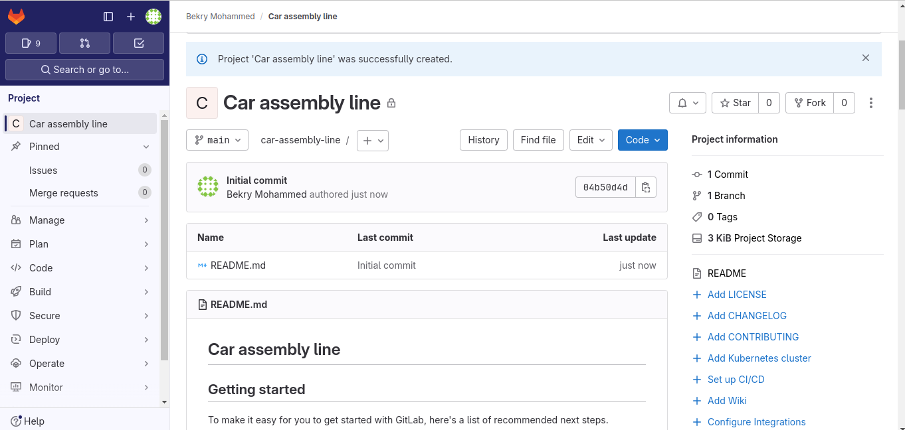
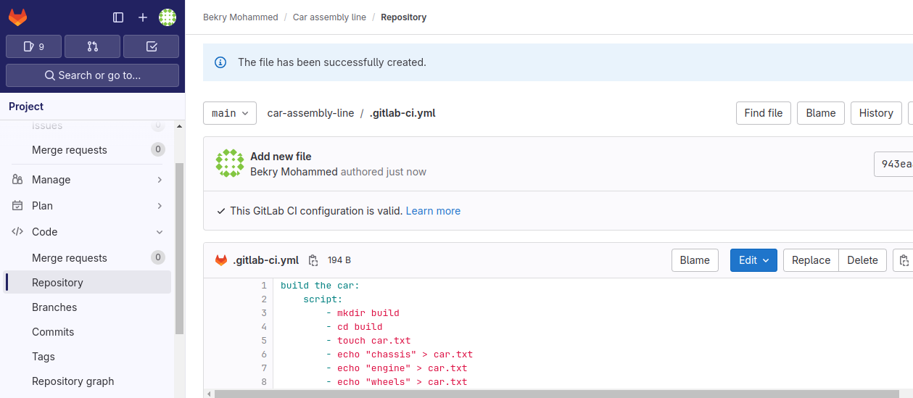
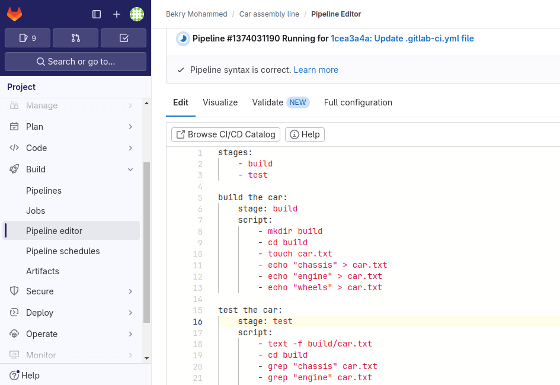
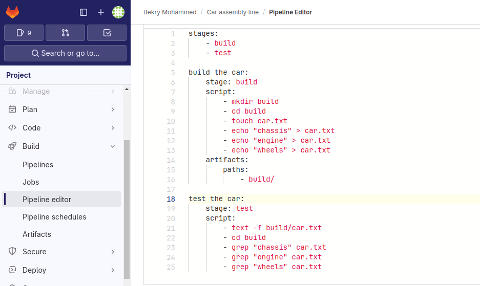
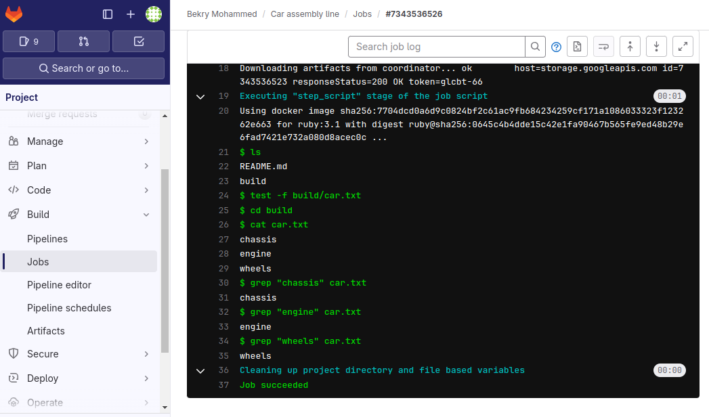

# ci-cd-gitlab

## Creating a Pipeline using gitlab

## Adding a yaml file 

## Writing a bash script

## Executing a pipeline

## Creating jobs and stages

## Adding Artifacts

## Running Pipeline

## Pipeline execution result

