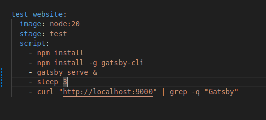

# CI/CD GitLab 

## Creating a Pipeline using gitlab

## Adding a yaml file 

## Writing a bash script

## Executing a pipeline

## Creating jobs and stages

## Adding Artifacts

## Running Pipeline

## Pipeline execution result

# M2 CI/CD WORKFLOW

## Part-1 Creating Static Website

    `node --version`
    `npm --version`
    `npm i -g gatsby-cli`
    `gatsby --version`
    `npm init gatsby`
    `cd website-folder/`
    `npm run develop`

### Building the project locally (build step)

### Creating yaml file

### Executing pipeline and adding artifacts

## Part-2 Adding a Test Stage 

### Creating Two test (Success and Fail Test)

### Creating Two jobs for test / Running jobs in parallel

#### gatsby serve issue running without release

#### gatsby serve issue running and release task

### Deployment using `surge.sh`

    `npm install --global surge`
    `surge`

### Environment Variables for Managing secrets

    `surge token`
    
- step-1: Go to setting side bar

- step-2: CI/CD

- step-3: Expand variable

- step-4: Click Add Variable

- step-5: Type SURGE_LOGIN name at the key field , email at the value field, uncheck box Protect variable and click Add variable button

- step-6: Click Add Variable again to add the surge token

- step-7: Type SURGE_TOKEN name at the key field , token at the value field, uncheck box Protect variable, check box Mask Variable and click Add variable button

## Part-3 Deploying Project using Gitlab CI

### Published website using surge.sh Automatically through Gitlab CI

## Task extend the pipeline and add a new stage

1 - add a new stage called "deployment tests".

2 - create a new job called "test deployment"

3 - download the first page of the website and search for a specific string (you can use the curl command)

### Let's find a way to improve the execution time.

4 - Use the Docker alpine image for this job.

