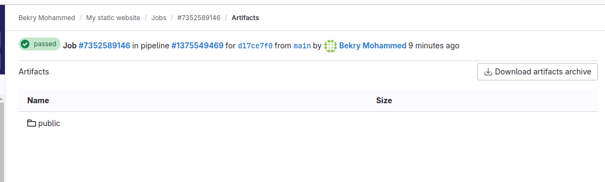
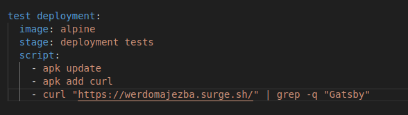
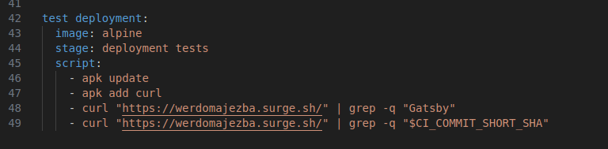

- [CI/CD GitLab](#cicd-gitlab)
  - [Creating a Pipeline using gitlab](#creating-a-pipeline-using-gitlab)
  - [Adding a yaml file](#adding-a-yaml-file)
  - [Writing a bash script](#writing-a-bash-script)
  - [Executing a pipeline](#executing-a-pipeline)
  - [Creating jobs and stages](#creating-jobs-and-stages)
  - [Adding Artifacts](#adding-artifacts)
  - [Running Pipeline](#running-pipeline)
  - [Pipeline execution result](#pipeline-execution-result)
  - [M2 CI/CD WORKFLOW](#m2-cicd-workflow)
    - [Building the project locally (build step)](#building-the-project-locally-build-step)
    - [Creating yaml file](#creating-yaml-file)
    - [Executing pipeline and adding artifacts](#executing-pipeline-and-adding-artifacts)
  - [Part-2 Adding a Test Stage](#part-2-adding-a-test-stage)
    - [Creating Two test (Success and Fail Test)](#creating-two-test-success-and-fail-test)
    - [Creating Two jobs for test / Running jobs in parallel](#creating-two-jobs-for-test--running-jobs-in-parallel)
    - [Deployment using `surge.sh`](#deployment-using-surgesh)
    - [Environment Variables for Managing secrets](#environment-variables-for-managing-secrets)
  - [Part-3 Deploying Project using Gitlab CI](#part-3-deploying-project-using-gitlab-ci)
    - [Published website using surge.sh Automatically through Gitlab CI](#published-website-using-surgesh-automatically-through-gitlab-ci)
  - [Task extend the pipeline and add a new stage](#task-extend-the-pipeline-and-add-a-new-stage)
    - [Let's find a way to improve the execution time.](#lets-find-a-way-to-improve-the-execution-time)
  - [M3 Gitlab CI Fundamentals](#m3-gitlab-ci-fundamentals)
    - [Predefined environment variables](#predefined-environment-variables)
    - [Optimize the build speed using Cache](#optimize-the-build-speed-using-cache)
    - [Disabling the cache for the jobs that do not need it](#disabling-the-cache-for-the-jobs-that-do-not-need-it)
    - [Configuring the global cache by specifying the pull policy](#configuring-the-global-cache-by-specifying-the-pull-policy)
    - [Deployment environments or staging](#deployment-environments-or-staging)
    - [Defining Variables](#defining-variables)
    - [Manual Deployments / Manually Triggering job](#manual-deployments--manually-triggering-job)
    - [Merge requests using branches](#merge-requests-using-branches)
  - [M5\_Using\_Gitlab\_CI\_to\_build\_and\_deploy\_a\_java\_application\_to\_AWS\_Elastic\_Beanstalk](#m5_using_gitlab_ci_to_build_and_deploy_a_java_application_to_aws_elastic_beanstalk)
    - [Build Stage - Build a java application with Gitlab CI](#build-stage---build-a-java-application-with-gitlab-ci)
    - [Test Stage - Add smoke test](#test-stage---add-smoke-test)
    - [Upload a file to AWS S3 from Gitlab CI](#upload-a-file-to-aws-s3-from-gitlab-ci)
    - [Deploy to a Java application to AWS Elastic Beanstalk using the AWS CLI](#deploy-to-a-java-application-to-aws-elastic-beanstalk-using-the-aws-cli)
    - [Create an application version](#create-an-application-version)
    - [Verifying the application version after deployment](#verifying-the-application-version-after-deployment)
    - [Create a Quality Stage with PMD](#create-a-quality-stage-with-pmd)
    - [Create Unit test Stage (Run JUnit tests with GitLab CI)](#create-unit-test-stage-run-junit-tests-with-gitlab-ci)
    - [API test stage Run Postman API tests in GitLab CI](#api-test-stage-run-postman-api-tests-in-gitlab-ci)
    - [GitLab Pages - Publishing HTML reports and Dashbords](#gitlab-pages---publishing-html-reports-and-dashbords)

# CI/CD GitLab 

## Creating a Pipeline using gitlab

## Adding a yaml file 

## Writing a bash script

## Executing a pipeline

## Creating jobs and stages

## Adding Artifacts

## Running Pipeline

## Pipeline execution result

## M2 CI/CD WORKFLOW

 Part-1 Creating Static Website

    `node --version`
    `npm --version`
    `npm i -g gatsby-cli`
    `gatsby --version`
    `npm init gatsby`
    `cd website-folder/`
    `npm run develop`

### Building the project locally (build step)

### Creating yaml file

### Executing pipeline and adding artifacts

## Part-2 Adding a Test Stage 

### Creating Two test (Success and Fail Test)

### Creating Two jobs for test / Running jobs in parallel

#### gatsby serve issue running without release

#### gatsby serve issue running and release task

### Deployment using `surge.sh`

    npm install --global surge
    surge

### Environment Variables for Managing secrets

    surge token
    
- step-1: Go to setting side bar

- step-2: CI/CD

- step-3: Expand variable

- step-4: Click Add Variable

- step-5: Type SURGE_LOGIN name at the key field , email at the value field, uncheck box Protect variable and click Add variable button

- step-6: Click Add Variable again to add the surge token

- step-7: Type SURGE_TOKEN name at the key field , token at the value field, uncheck box Protect variable, check box Mask Variable and click Add variable button

## Part-3 Deploying Project using Gitlab CI

### Published website using surge.sh Automatically through Gitlab CI

## Task extend the pipeline and add a new stage

1 - add a new stage called "deployment tests".

2 - create a new job called "test deployment"

3 - download the first page of the website and search for a specific string (you can use the curl command)

### Let's find a way to improve the execution time.

4 - Use the Docker alpine image for this job.

## M3 Gitlab CI Fundamentals

### [Predefined environment variables](https://docs.gitlab.com/ee/ci/variables/predefined_variables.html)

- To create a variable that give the first eight characters of CI_COMMIT_SHA

- In index.js file add environment variable

- version number at the build stage log info

- test deployment of the version on the website

### Optimize the build speed using Cache

### Disabling the cache for the jobs that do not need it

    `cache:{}`

### Configuring the global cache by specifying the pull policy

#### Task: create a job that runs only once per day and updates the cache. The job will not need to download the caches (pull). It only needs to create new caches (push).

#### 1 - create a stage called "cache"

#### 2 - create a job called "update cache"
#### 3 - make sure the job does runs the command npm install (to install all dependencies)
#### 4 - add the following cache policy to the job: policy: push. Note that you will need to define the entire cache configuration (as you have done globally). You can not  override only the policy.
#### 5 - make sure the "update cache" job only runs when the pipeline is triggered by a schedule

#### 6 - make sure that all other jobs DO NOT RUN when the pipeline is triggered by a schedule

#### 7 - create a new scheduled pipeline run and make it run once per day

#### 8 - manually run the scheduled pipeline and inspect the pipeline (only one job should be displayed)

#### 8 - manually the pipeline (the "update cache" job should not appear in the pipeline)

### Deployment environments or staging

### Defining Variables

### Manual Deployments / Manually Triggering job

### Merge requests using branches

#### Jobs that run on the main branch

      only
        - master

#### Create Branch 

- On the left sidebar, select Search or go to and find your project.
- Select Code > Branches.
- In the upper-right corner, select New branch.
- Enter a Branch name.
- In Create from, select the base of your branch: an existing branch, an existing tag, or a commit SHA.
- Select Create branch.

#### Develop and main branches

    git checkout main
    git checkout -b develop
    git push -u origin develop
    # Creating a feature branch
    git checkout -b feature_branch
    # work happens on feature branch
    # Finishing a feature branch
    git checkout develop
    git merge feature_branch
    git checkout main
    git merge develop
    git branch -d feature_branch

#### When using the git-flow extension library, executing git flow init on an existing repo will create the develop branch:

    git checkout main
    git flow init
    # Creating a feature branch
    git flow feature start feature_branch
    # Finishing a feature branch
    git flow feature finish feature_branch

#### see the status of the pipeline for a specific branch

#### Protecting main branch from random push

- Go to settings -> repository -> Protected branch

#### Merge request

- Go to settings -> merge requests -> Fast-forward merge && pipeline must succeed

- merge request status

#### Dynamic Environment - reviewing the changes on each branch

- branch pipeline status on feature branch

- review branch pipeline status on feature branch

#### Destroy Environments (Clean up after merge request)

#### Disabling a job by aadding a "." before the stages

### Creating job template

## M5_Using_Gitlab_CI_to_build_and_deploy_a_java_application_to_AWS_Elastic_Beanstalk

### Build Stage - Build a java application with Gitlab CI

### Test Stage - Add smoke test

### Upload a file to AWS S3 from Gitlab CI

### Deploy to a Java application to AWS Elastic Beanstalk using the AWS CLI

### Create an application version

### Verifying the application version after deployment

### Create a Quality Stage with PMD

### Create Unit test Stage (Run JUnit tests with GitLab CI)

### API test stage Run Postman API tests in GitLab CI

### GitLab Pages - Publishing HTML reports and Dashbords

